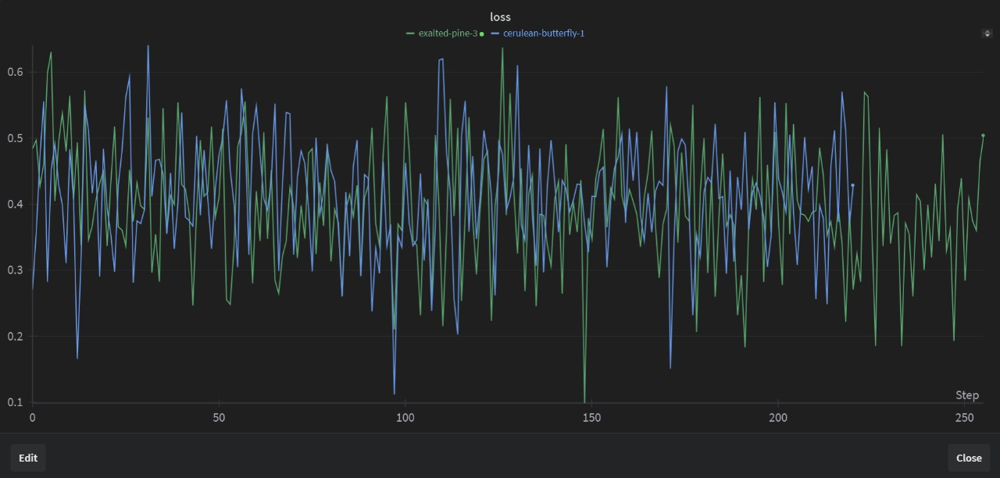
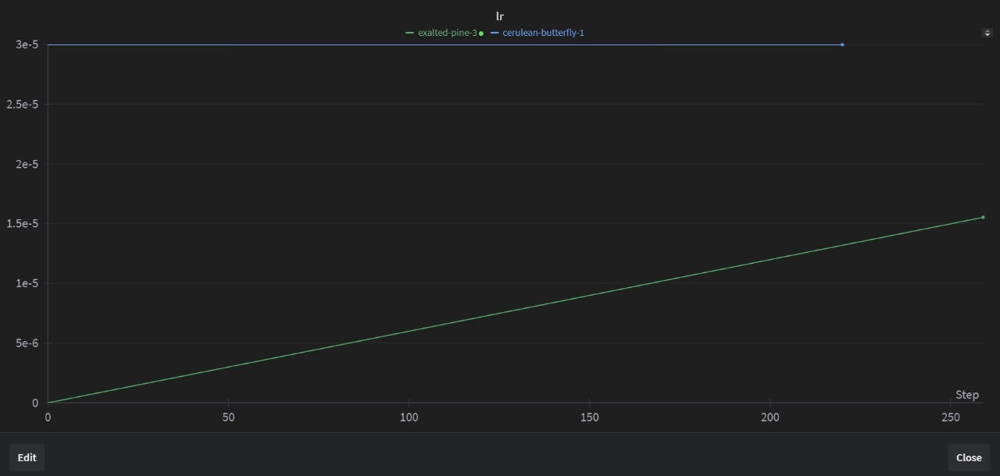

<p align="left">
    
</p>

# 🎨 AI-Powered Poster Generator

We've designed a machine learning model capable of generating images that **accurately incorporate specified text or lettering within the image**. Existing image-generation models often struggle with proper text placement, either misplacing the text or introducing spelling errors. Our goal is to train the model to master the art of **placing text accurately and aesthetically within generated images**. This innovation enables the seamless creation of visually appealing outputs such as **poster designs** and **template fills**, all from a single prompt.

---

## 🚀 Motivation

Despite advancements in AI image generation, **no large language models (LLMs)** or image-generating models are currently capable of achieving perfect text placement in images like movie posters. Existing models often:
- Make **mistakes in text placement**, leading to poor visual aesthetics.
- Introduce **spelling or formatting errors** in the text.

Our project tackles these challenges by combining **state-of-the-art AI models** and a carefully curated training pipeline to develop a model that excels in:
1. Generating high-quality images.
2. Accurately placing text in unstructured, visually appealing ways.
3. Maintaining spelling and stylistic integrity.

---

## ⚙️ Approach

### 1. **🎥 Image Generation**
We used the **[`black-forest-labs/FLUX.1-dev`](https://huggingface.co/black-forest-labs/FLUX.1-dev)** model for **image generation**. This served as the foundation for creating visually stunning poster-like images.

### 2. **🔧 Conditional Image Control**
To control the image parameters (such as resolution, strength, DDIM sampling, seed, etc.), we utilized the **[`lllyasviel/ControlNet`](https://github.com/lllyasviel/ControlNet)** framework. ControlNet ensures that AI understands the layout constraints required for text.

### 3. **🛠️ Data Collection and Preprocessing**
We curated our dataset using the following steps:
- **Data Collection**: Extracted thousands of poster images from various sources and performed operations like removing outliers, null entries, and invalid images.
- **Caption Generation**: Captions were automatically generated for each image using the **[`vikhyatk/moondream2`](https://huggingface.co/vikhyatk/moondream2)** model, which provided detailed descriptions of the posters.
- **Conditional Images**: We generated lineart-style conditional images for each poster using the **[`lllyasviel/ControlNet-v1-1-nightly`](https://github.com/lllyasviel/ControlNet-v1-1-nightly/blob/main/README.md#controlnet-11-lineart)** model. These conditional images guided the AI on text placement.

### Structure of the Dataset:
| **🖼️ Image**        | **✍️ Caption**                                                             | **🖊️ Conditional Image**     |
|----------------------|---------------------------------------------------------------------------|-------------------------------|
| Movie poster image   | A description of the poster, including characters, text, colors, etc.    | Lineart representation        |

- **Final Dataset**: You can view the dataset **[here](https://huggingface.co/datasets/fhai50032/ControlNet-Poster)**.

---

### 4. **🧠 Model Training**

We've successfully trained the model on a **small batch** of our dataset using an **NVIDIA A100 GPU**. While the model is not yet fully advanced (due to GPU limitations), it is capable of placing text within images with a basic level of aesthetic appeal.

---

## 🔍 Training Results

### **📉 Loss Graph**
The training loss over 250 steps:
- 🔵 Previous loss
- 🟢 New loss



### **🧭 Learning Rate**
The learning rate progression during training:



---

## ✨ Generated Results
The model generated the following results based on early training:

```python
link = "https://csvtu.ac.in/ew/pics/DigiVarsity.png"
image = load_image(link)
control_image = processor(image)
controlnet_conditioning_scale = 0.65
width, height = control_image.size
prompt = "print a poster for a website with text 'DIGIVARSITY', make background as sunset mountain college"
image2 = pipe(
    prompt,
    control_image=control_image,
    control_mode=0,
    width=width,
    height=height,
    controlnet_conditioning_scale=controlnet_conditioning_scale,
    num_inference_steps=38,
    guidance_scale=3.2,
).images[0]
image2.save("image.jpg")
load_image("image.jpg")
```

  

### Observations:
1. **Text Placement**: The model has learned a basic level of text placement (but requires further refinement for complex layouts).
2. **Visual Appeal**: The generated images aligned with the prompts but need improvements in text styling and complexity.
3. **Next Focus**: Extended training and dataset expansion aimed to enhance output quality.

## 🔮 Next Steps
1. Train the model further using the full dataset for improved performance.
2. Fine-tune the model to handle unstructured text formats with greater precision.
3. Optimize for visually stunning and error-free text placement in generated images.
---

## 🛠️ Tools & Models 

- **Image Generation**: [`FLUX.1-dev`](https://huggingface.co/black-forest-labs/FLUX.1-dev)  
- **Control Parameters**: [`ControlNet`](https://github.com/lllyasviel/ControlNet)  
- **Caption Generation**: [`moondream2`](https://huggingface.co/vikhyatk/moondream2)  
- **Conditional Image Generation**: [`Lineart`](https://github.com/lllyasviel/ControlNet-v1-1-nightly/blob/main/README.md#controlnet-11-lineart)
- **Text Encoder**:[`FLUX.1-dev-4bit`](https://huggingface.co/HighCWu/FLUX.1-dev-4bit)
- **Unified Controlnet Model**:[`FLUX.1-dev-ControlNet-Union-Pro`](https://huggingface.co/Shakker-Labs/FLUX.1-dev-ControlNet-Union-Pro)

---

## 🤝 Contributing

This project is a work in progress. Contributions are welcome! If you'd like to contribute:
1. Fork the repository.
2. Submit a pull request with your changes or suggestions.

---

## 🔗 More Information

More information about the project is available at [**subh-775**](https://huggingface.co/Subh775) and [**fhai50032**](https://huggingface.co/fhai50032).

---

## 🏆 Acknowledgements

Special thanks to various authors :
- **[fhai50032](https://github.com/IsNoobgrammer)** for his valuable contributions to this project.
- **`Black Forest Labs`** for the **`FLUX.1-dev`** model.  
- **`lllyasviel`** for ControlNet and Annotators, which made conditional image generation possible.  
- **`vikhyatk`** for the **`moondream2`** model, enabling automated caption generation.
---

## 📜 License
```text
Apache License 2.0

Licensed under the Apache License, Version 2.0 (the "License");
you may not use this file except in compliance with the License.
You may obtain a copy of the License at

   http://www.apache.org/licenses/LICENSE-2.0

Unless required by applicable law or agreed to in writing, software
distributed under the License is distributed on an "AS IS" BASIS,
WITHOUT WARRANTIES OR CONDITIONS OF ANY KIND, either express or implied.
See the License for the specific language governing permissions and
limitations under the License.
